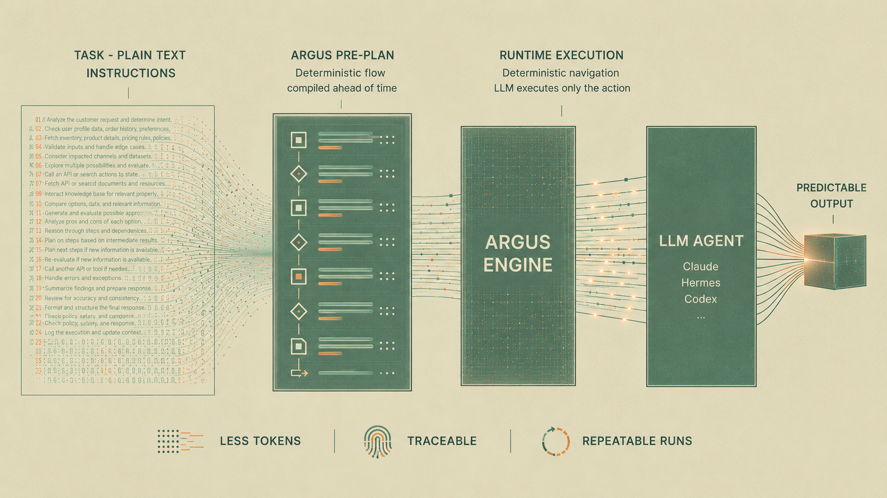

# Botcircuits Argus

**Argus** helps AI agent (Claude, Codex, OpenClaw, Hermes, etc.) to run your workflows **predictably**, **traceably**, and **cost-efficiently**. It achieves this through a combination of structured flow control and stateful memory context.

```
claude > "create an order fulfillment workflow with stock check, ship, and backorder branches"
claude > "run order fulfillment"
```

## A better model for execution
Traditionally, AI agents are left to guess their next move, leading to unpredictable reasoning loops. Argus SKILL introduces a much more effective model: structured flow control.

## Stateful memory context
Complex tasks require perfect continuity. This SKILL enables your agent to handle multi-step workflows without ever losing track.




---

## How it works

Argus ships **two skills** your agent loads:

| Skill | The user says… | The agent does… |
|---|---|---|
| **botcircuits-workflow-authoring** | _"create an order fulfillment workflow with …"_ | Writes the workflow JSON and builds it. |
| **botcircuits-workflow-running** | _"run order fulfillment"_ | runs workflow, the **deterministic engine** works in a background and dispatches each action to ai agent |

---

## Installation

Argus runs inside a host agent. Install the agent you want, then install Argus

### 1. Install a host agent (if you don't have one)


### 2. Install BotCircuits Argus

```bash
curl -fsSL https://raw.githubusercontent.com/botcircuits-ai/botcircuits-argus/main/scripts/install.sh | bash
```

### 3. Install SKILLs

```bashbotcircuits skills install [--agent claude|hermes] [--link]``` | Install the workflow skills into a host agent (default: `~/.claude/skills`)

## Workflows

### Workflow authoring
You can simply converse with your AI agent to generate the initial structure naturally. If you prefer a visual approach, you can map out the logic using the UI flow editor using manager.

```
claude > "create an order fulfillment workflow: check stock; if all items are in stock, ship; otherwise create a backorder and notify the customer"
```

### Workflow run
```
claude > "run order fulfillment for order #1024"
```

> Same thing inside Hermes (`hermes "run order fulfillment …"`). The host agent follows the skills and shells out to the `botcircuits` CLI for you.

### How it works
The raw file is *not* what runs. **workflow-builder** compiles each natural-language `condition` into a deterministic `choices[]` entry and emits an aggregated `flow.variables` list.

The runtime only loads from `.botcircuits/workflows/.build/`. The authoring skill builds for you automatically.

- `.botcircuits/workflows/*.json` — your authored sources (override the dir with `BOTCIRCUITS_WORKFLOWS_DIR`).
- `.botcircuits/workflows/.build/` — built, runnable copies.
- `.botcircuits/workflows/.runs/` — transient pause/resume cursors.

#### Workflow Shape

A workflow is one JSON file under `.botcircuits/workflows/`:

```json
{
  "name": "order_fulfillment",
  "description": "Check stock, then ship or backorder.",
  "flow": {
    "start": "start",
    "steps": {
      "start": { "type": "start", "next": "check_stock" },
      "check_stock": {
        "type": "agentAction",
        "settings": { "action": "Check stock for the order items." },
        "next": "backorder",
        "conditions": [
          { "condition": "all items are in stock", "next": "ship" }
        ]
      },
      "ship":      { "type": "agentAction", "settings": { "action": "Ship the order." } },
      "backorder": { "type": "agentAction", "settings": { "action": "Create a backorder and notify the customer." } }
    }
  }
}
```
- Step types are `start`, `agentAction`, and `question`. 
- To branch, attach a `conditions` list at the **step root** (a sibling of `type` and `next`)
---

## Argus Web Manager

Use the BotCircuits Manager to author workflows, edit them via the visual Flow UI, and monitor execution traces.

- username/password override with `BOTCIRCUITS_MANAGER_ADMIN_USERNAME` / `_ADMIN_PASSWORD`, or default `admin`/`admin`

```bash
# Start the manager
botcircuits manager start 

# Restart the manager
botcircuits manager restart 

# Stop the manager: 
botcircuits manager stop
```

---

## License

Licensed under the Apache License, Version 2.0 — [LICENSE](LICENSE)

## Built by [BotCircuits](https://botcircuits.ai)
